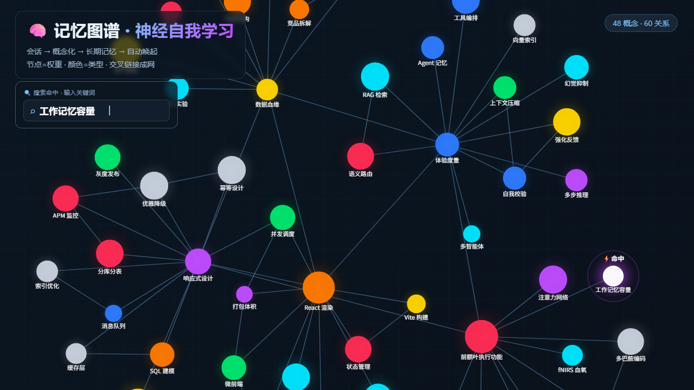

# dsh-okf-memory

[简体中文](README.md) | English

**Session-to-OKF memory plugin with neuro-self-learning: predictive recall, uncertainty-driven capture, reinforcement feedback, consolidation & forgetting.**

Turn high-value content from your conversations into persistent long-term memory, organized as [OKF v0.1](https://github.com/open-knowledge-format) knowledge documents. The agent gets smarter the more you use it — every selection, skip, and correction is a learning signal that updates memory weights.



[](https://dshfind.com/zh/plugins/ZHI-QI/dsh-okf-memory?ref=badge)

## Features

- **Four-stage memory loop**: Capture → Concept-ize (OKF) → Consolidate → Recall
- **OKF v0.1 compliant**: every concept is a standard Markdown document (frontmatter hard-requires `type`), `index.md` progressive catalog + `log.md` change history, cross-links use bundle-absolute paths
- **Neuro-self-learning driver**: predictive recall (predict first, then verify by retrieval), uncertainty-driven exploration (expand search when confidence is low), prediction-error-driven capture (user corrections / first-time disclosures / counter-intuitive conclusions trigger writes), weight decay + archiving (consolidation & forgetting)
- **Reinforcement feedback loop**: `score = relevance × weight × recency`; selecting a candidate raises its weight, skipping lowers it
- **TechChoice memory**: frontend / backend / language / approach / config — one concept per dimension with an options table + active choice; three-tier selection rule (show all candidates, use the only candidate, or follow the matched dimension)
- **Write permission gate**: type validity → dedup (complement, never duplicate, cross-link) → OKF compliance check
- **Memory graph visualization (M2)**: a client panel renders a force-directed **memory graph** in the DSH conversation view — node size = weight, color = type; search hit → pulse halo + ⚡hit + neural spreading; zoom / pan / drag / hover details
- **Graph data API**: `okf_graph` tool + `service.graph` produce `{nodes,edges,timeline}` JSON with a stable contract, reusable by any frontend

## Install

```sh
# Any profile (e.g. web): published to npm, one-line install, no build approval
dsh plugin --profile web add dsh-okf-memory
# Or from a local checkout (dev):
dsh plugin --profile web add ./dsh-okf-memory
# Or from GitHub source (needs a prepare build + user build approval):
dsh plugin --profile web add github:ZHI-QI/dsh-okf-memory
```

**Published on npm**: `dsh-okf-memory@0.1.0` → https://www.npmjs.com/package/dsh-okf-memory

Zero runtime dependencies (peer dependency `@deepseek-ai/cordis` is provided by the dsh runtime; a peer warning during install can be ignored). Install and use — no build step, no build-script approval needed.

## How to Use

Once installed you don't have to type any commands. The plugin injects a "memory discipline" system prompt that tells the agent to **decide on its own** what to remember and what to look up, using the tools below. You can also trigger it explicitly by saying "remember X" or "check the memory for X".

### The 5 tools

| Tool | What it does | When to use |
|---|---|---|
| `okf_remember` | Writes one memory (auto-dedup, validate, persist) | When something worth keeping is learned |
| `okf_search` | Keyword recall, ranked by weight/recency | Session-start preload, find relevant memory before answering |
| `okf_read` | Reads one memory in full (with cross-links), records a usage feedback | When you need complete detail |
| `okf_forget` | Revokes one memory | When it was wrong / is no longer needed |
| `okf_graph` | Exports the memory graph JSON (nodes/edges/timeline) | Visualization / handing off graph data |

### Make it remember (write)

- **Automatic (recommended)**: when you disclose new facts, make a decision, correct the agent, or mention a tech choice, the agent **judges on its own** whether to store it — you don't have to ask.
- **Manual**: just say "remember…", e.g. `记住,我的三家门店是韶山/湘乡/塘厦,共用局域网共享文件夹`.

**Worth remembering**: new background facts/preferences, decisions and their reasons, reusable methods/processes/lessons, user corrections, confirmed counter-intuitive conclusions, tech choices.
**Not remembered**: small talk, one-off scaffolding questions, repeats of already-stored content, unverified guesses (those land in `Idea` until they mature).

### Make it recall

- When you ask something related, the agent runs `okf_search` first, then answers.
- You can also say "check the memory for X" explicitly.
- **If nothing is found it tells you plainly — it never fabricates.**

### Tech choices (TechChoice)

For frontend/backend/language/approach/config selections the plugin follows the **three-tier rule** (see the dedicated section below): 2+ candidates → show all for you to pick; exactly 1 → use it directly; no tech named but a dimension keyword is hit (e.g. "frontend") → resolve via that dimension's memory; a new approach/switch/config → append-only update, never overwrite prior candidates.

### Examples: how to remember, how to look up

```text
// ① Remember a store fact (Fact)
User: 记住,我的三家门店是韶山/湘乡/塘厦,共用局域网共享文件夹
Agent: okf_remember(title="门店布局", type="Fact",
        content="# 核心\n\n三家门店共用局域网共享文件夹…", tags=["门店"])
       → Memory saved: fact/门店布局

// ② Remember a frontend choice (TechChoice)
User: 前端就用 React 18 + Vite 吧
Agent: okf_remember(type="TechChoice", title="前端方案",
        content="## Options\n\n| 候选 | 状态 |\n|---|---|\n| React 18 + Vite | active |",
        tags=["前端","技术选型"])

// ③ Querying a database — recall first (instead of scanning local files)
User: 帮我查询数据库
Agent: okf_search(query="查询数据库")
       → hit「鼎赞数据统一用 mcp-dezensaas-mysql」
       → route to the mcp-dezensaas-mysql service
```

## Visual Graph (DSH conversation-view tab)

The plugin ships a `client-plugin` that registers a "**Memory Graph**" tab in the DSH web conversation view:

- **Force-directed graph**: node size = weight, color = type (fact/preference/decision/method/insight/idea/lesson/techchoice), lines = cross-links
- **Search hit**: type in the top box to hit title/type/tags → the hit node gets a white border + pulse halo + `⚡hit`, plus BFS spreading to related nodes
- **Interaction**: wheel zoom, drag-pan, drag nodes, hover for details (title/type/weight/description/tags)

Data comes from the backend `/okf-graph` route (webServer, web profile only), served by the `okf_graph` tool / `service.graph`.

## Memory Library Layout

Default `~/.dsh/memory/` (overridable via `OKF_MEMORY_ROOT`):

```
~/.dsh/memory/
├── index.md              ← Progressive catalog (okf_version: "0.1")
├── log.md                ← Change history (## YYYY-MM-DD)
├── fact/                 ← Fact
├── preference/           ← Preference
├── decision/             ← Decision (three-section: Data / Analysis / Conclusion)
├── method/               ← Method
├── insight/              ← Insight
├── idea/                 ← Idea
├── lesson/               ← Lesson
├── techchoice/           ← TechChoice (Options table + Active)
└── .meta/weights.json    ← Learning weights (does not affect OKF compliance)
```

## TechChoice Three-Tier Rule (user-defined protocol)

1. **2+ candidates** matched → present **all** candidates to the user; never decide on your own
2. **1 candidate** → use it directly
3. No specific technology mentioned but a dimension keyword is hit (e.g. "frontend") → resolve via that dimension's memory
4. New technology / switch / config details → append-only update, never overwrite old candidates (keeps v1→vN evolution history)

## Configuration

| Item | How | Default |
|---|---|---|
| Memory root | env `OKF_MEMORY_ROOT` or settings `okfMemory.root` | `~/.dsh/memory/` |
| Learning params | `PARAMS` in `lib/learning.js` (decay days / archive threshold / …) | see file |

## Development & Testing

```sh
npm test                      # Full suite (smoke + integration + schema + concurrency + regression)
node scripts/smoke.js         # Core module functional tests (incl. write-lock assertions)
node scripts/integration.js   # Mock dsh ctx integration tests (incl. error paths)
node scripts/schema-check.js  # Tool schema compliance
node scripts/concurrency.js   # Write-lock stress test (50 parallel writes / 5 parallel feedbacks)
node scripts/regression.js    # P0 regression: lock reentrancy/error recovery, merge edge cases, path traversal, forget idempotency
```

## License

MIT
