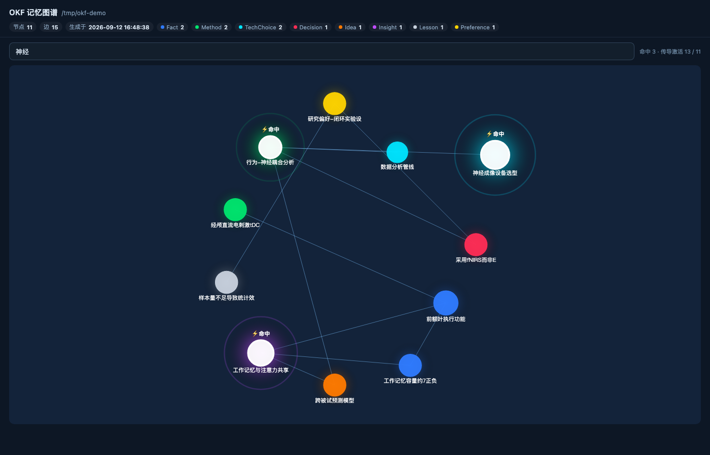

# pi-okf-memory

[简体中文](README.md) | English

**Session memory → OKF knowledge. Make pi remember you across sessions.**

High-value content from your sessions is distilled into long-term memory as [OKF v0.1](https://github.com/open-knowledge-format) documents, and recalled automatically in later sessions. Every pick, skip and correction is a learning signal — recall gets sharper the longer you use it.

> **中文速览** —— `pi-okf-memory` 把 pi 会话中的高价值内容沉淀为持久的 [OKF v0.1](https://github.com/open-knowledge-format) Markdown 文件,
> 并在之后的会话中自动唤起。记忆完全属于你:纯文件,可读、可 `git`、可手改。权重随你的每次选择与跳过持续调整,召回越来越准。
> **安装:** `pi install npm:pi-okf-memory`(或 `pi install git:github.com/ZHI-QI/pi-okf-memory`)。
> 一个命令:`/okf`。六个工具:`okf_remember` / `okf_search` / `okf_read` / `okf_forget` / `okf_graph` / `okf_feedback`。
> [完整中文说明 →](README.md)



---

## Why

Every new pi session starts from zero, so you keep repeating yourself:

> "I use pnpm, not npm."
> "Revenue data comes from the Dezensaas MySQL — don't grep local files."
> "We settled on React 18 + Vite last quarter; stop asking about the frontend."

`pi-okf-memory` turns that into files. The memory is yours, not a black box:

- **Readable** — plain Markdown. Open it, `git` it, hand-edit it.
- **Portable** — one directory. Copy it and the whole memory moves with you.
- **Honest** — when nothing matches, it says "not in the memory library" instead of making something up.

## Install

```sh
pi install git:github.com/ZHI-QI/pi-okf-memory        # from GitHub
pi install /path/to/pi-okf-memory                     # from a local checkout
pi -e /path/to/pi-okf-memory/src/pi/index.ts          # try it without writing config
```

Zero runtime dependencies and **no build step** — pi loads TypeScript directly via [jiti](https://github.com/unjs/jiti) and provides `typebox` / `@earendil-works/pi-*` through aliases.

## Usage

### You don't need to learn any commands

Once installed, the plugin injects a "memory discipline" prompt and pi decides on its own what to store and what to look up:

```
You: Remember — my three stores are Shaoshan/Xiangxiang/Tangxia, sharing a LAN folder
     → pi judges value, dedupes, writes the concept, updates the index

You: Where should revenue queries go?
     → pi runs okf_search first, then answers from memory instead of guessing

You: Search memory for anything about stores
     → explicit recall
```

### 6 tools (called by pi autonomously)

| Tool | Purpose |
|---|---|
| `okf_remember` | Write a concept (type validation → dedupe → section-level merge → persist) |
| `okf_search` | Recall ranked by relevance × weight × recency; `TechChoice` hits include the full options table |
| `okf_read` | Read a concept in full (with cross-links) and record one usage feedback |
| `okf_forget` | Withdraw a concept (file kept by default for traceability; optionally delete) |
| `okf_graph` | Export the graph JSON (nodes / edges / timeline) |
| `okf_feedback` | User selected `+1.0` / skipped `−0.5` — moves weights directly |

### Commands: just `/okf`

Only **one** command is registered; subcommands complete with Tab (type `/okf ` then Tab).

| Command | Purpose |
|---|---|
| `/okf` | Library status: root, concept count, weight leaderboard |
| `/okf search <query>` | Search (short alias `/okf s`) |
| `/okf graph` | Export a **single self-contained** interactive HTML graph and open it (alias `/okf g`) |
| `/okf consolidate` | Run consolidation now, decay + archive (alias `/okf c`) |
| `/okf help` | List all subcommands |

### What gets remembered

| Worth storing ✅ | Not worth storing ❌ |
|---|---|
| New background facts, preferences, habits | Greetings, process chatter |
| Decisions **and their rationale** | One-off tasks |
| Reusable methods, processes, lessons | Restating what's already stored |
| **When you correct pi** (strongest signal) | Unverified guesses (goes to `Idea` until it matures) |
| Counter-intuitive findings you confirm | |
| Technology choices (frontend/backend/language/approach/config) | |

## How it works

```
capture ──→ conceptualize ──→ persist ──→ recall
  │            │                 │           │
  │            │                 │           └─ rank by relevance × weight × recency, write back feedback
  │            │                 └─ validate type → dedupe by title → section-level merge → update index/log
  │            └─ 8-type vocabulary + OKF v0.1 frontmatter validation
  └─ pi decides whether this turn produced knowledge worth keeping
```

### Weighted learning

Recall score is `relevance × weight × recency`, and weight follows your behaviour:

| Behaviour | Weight |
|---|---|
| User selects / confirms an option | **+1.0** |
| User skips / rejects | **−0.5** |
| Concept read and used | +0.1 |
| Untouched for 30 days | starts decaying (`0.9^(days over 30 / 30)`) |
| Weight < 0.3 | archived (`inactive` — **never deleted, revivable**) |
| Used again after archiving | restored to ≥ 0.6 |

Decay is **incremental**: if no time has passed, nothing is deducted. Running consolidation repeatedly gives exactly the same result as running it once.

### TechChoice three-tier rule (built-in protocol)

For frontend/backend/language/approach/config decisions:

1. **2+ candidates match** → present all of them and let you choose; never decide unilaterally
2. **1 candidate matches** → use it directly
3. You didn't name a technology but the message matches a dimension keyword (e.g. "frontend") → handle via that dimension's memory
4. You propose a new option / switch / config → **append** rather than overwrite (keeps the v1→vN trail)

## Memory library layout

Defaults to `~/.pi/agent/okf-memory/` (override with `OKF_MEMORY_ROOT`):

```
~/.pi/agent/okf-memory/
├── index.md            ← progressive index (okf_version: "0.1")
├── log.md              ← change history (## YYYY-MM-DD)
├── fact/               ← background facts
├── preference/         ← preferences
├── decision/           ← decisions (three-part: data / analysis / conclusion)
├── method/             ← methodologies
├── insight/            ← insights
├── idea/               ← unformed ideas
├── lesson/             ← lessons learned
├── techchoice/         ← technology choices (Options table + Active)
└── .meta/weights.json  ← learning weights (dot dir, keeps OKF conformance clean)
```

A concept ID *is* its relative path (e.g. `fact/store-layout`), and cross-links use in-bundle absolute paths: `[text](/fact/store-layout.md)`.

## Graph visualization

`/okf graph` produces a **single self-contained** HTML file (no CDN, no build artifacts) you can double-click or share:

- Node size = weight, colour = type, dashed outline = archived
- Hover for details, scroll to zoom, drag to pan, drag nodes to rearrange
- A search hit gets a white ring, a pulse, and `⚡hit`, then **BFS-propagates** along cross-links to light up related memories

## Configuration

| Item | How | Default |
|---|---|---|
| Memory root | `OKF_MEMORY_ROOT` env var | `~/.pi/agent/okf-memory/` |
| Learning parameters | `PARAMS` in `src/server/learning.ts` | see "Weighted learning" above |

Tuning knobs live in `PARAMS`: `SELECT_DELTA` / `SKIP_DELTA` / `HIT_DELTA` / `DECAY_DAYS` / `DECAY_FACTOR` / `ARCHIVE_THRESHOLD` / `ARCHIVE_RECOVER` / `CONSOLIDATE_INTERVAL_MS`.

## The same core also drives the dsh plugin

The runtime-agnostic core (`src/server/*`) has zero host coupling — its only imports are `node:fs` / `node:path` / `node:os`, and `src/server/index.ts` is the sole dsh adapter. So the dsh plugin `dsh-okf-memory` and the pi extension `pi-okf-memory` share one implementation:

| | pi (this repo's focus) | dsh |
|---|---|---|
| Adapter | `src/pi/index.ts` | `src/server/index.ts` |
| Default library | `~/.pi/agent/okf-memory/` | `~/.dsh/memory/` |
| Prompt injection | `pi.on("before_agent_start")` | `ctx.systemPrompt.section()` |
| Graph | `/okf graph` exports HTML | web conversation-view tab |
| Tools | 6 | 5 |

Both honour `OKF_MEMORY_ROOT` — point them at the same directory to share one memory library.

## Development & testing

```sh
pnpm install
pnpm test          # typecheck + build + 6 suites, 250 assertions, offline & deterministic
pnpm test:e2e      # real-model end-to-end (needs a token), 9 assertions
```

| Layer | Script | What it proves |
|---|---|---|
| Type check | `tsc -p tsconfig.typecheck.json` | Adapter usage matches pi's **real `.d.ts`** |
| Core | `scripts/smoke.js` | store / concept / dedupe / learning / recall / graph |
| dsh integration | `scripts/integration.js` | 5 tools end-to-end under a mocked dsh ctx |
| pi integration | `scripts/pi-integration.js` | 6 tools + 4 commands + schema validation under a mocked pi API |
| **pi real RPC** | `scripts/pi-rpc-commands.js` | Commands are recognised and executed by a **real pi process** |
| **Real-model E2E** | `scripts/pi-e2e-model.js` | The model really calls the tools, really persists, really recalls across sessions |

**Why the last two layers exist**: a hand-written mock only proves "the code matches my assumptions" — not that the assumptions are right. This project's first real bug slipped through exactly there: the model never knew to pass the `related` parameter, so in real use the graph was always a set of edgeless islands while every mock test stayed green.

**Note**: `tsdown` (rolldown) strips types without checking them, so a passing `pnpm build` does *not* mean the types are correct — `typecheck` is a separate layer.

## License

MIT
